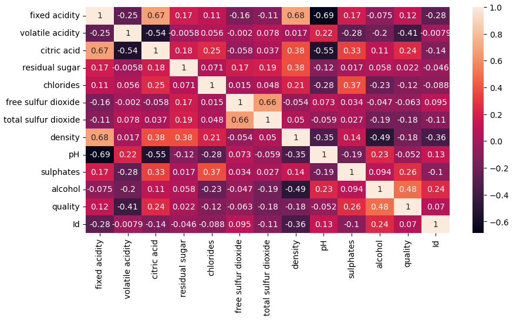
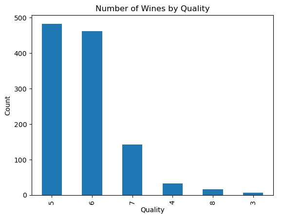
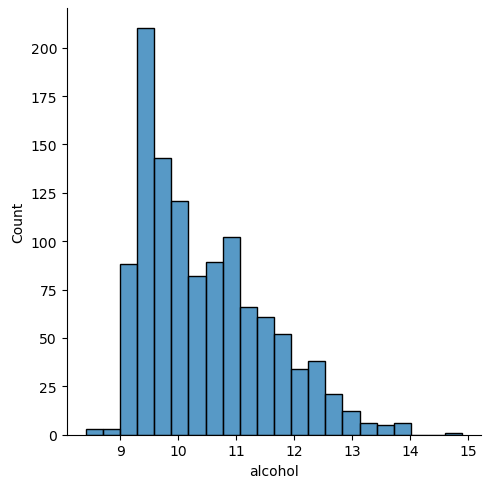
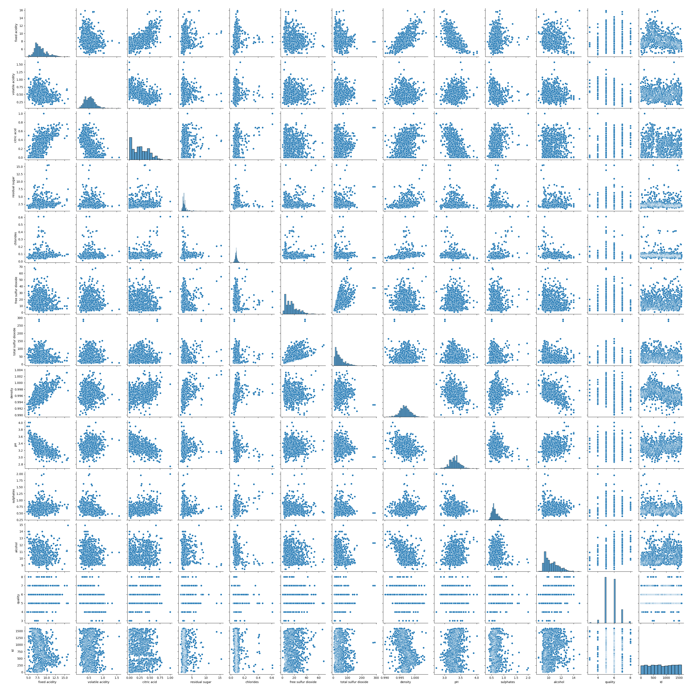
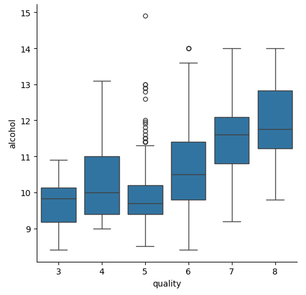
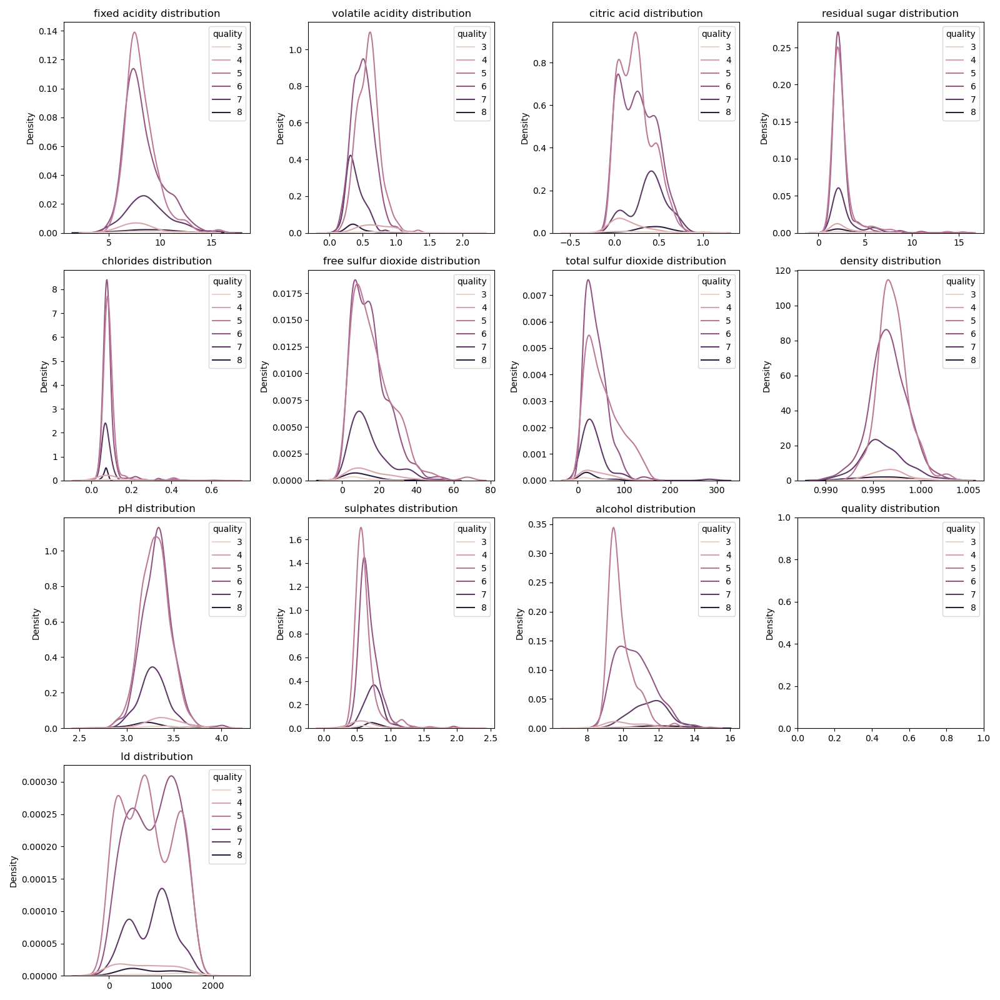

# Wine Quality Analysis
"**[Wine Quality Dataset](https://www.kaggle.com/datasets/yasserh/wine-quality-dataset)**" veri setini kullanarak veri analizi ve görselleştirme yöntemlerini deneme amaçlı geliştirilen bir projedir. Projede farklı metriklerin şarap kalitesi üzerindeki etkisi incelenmekte ve bu ilişkileri ortaya koyan görsel analizler sunulmaktadır.

## Proje Amacı
Projenin temel amacı bir şarabın kalitesini etkileyen faktörlerin arasındaki ilişkileri anlamak ve bazı metrikler üzerinde analiz yapmaktır.

## Kullanılan Teknolojiler
* **Python**
* **Jupyter Notebook**
* **Pandas**
* **NumPy**
* **Seaborn & Matplotlib**

## Analizler ve Görselleştirmeler

### Korelasyon Matrisi
Tüm kimyasal özelliklerin birbirleriyle olan ilişkisini gösteren bir heatmap'tir. Bu grafik sayesinde şarap kalitesiyle en güçlü pozitif ve negatif korelasyona sahip özellikleri hızlıca tespit edebiliriz.


### Kaliteye Göre Şarap Sayıları
Bu grafikte farklı kalite derecelerine sahip şarapların veri setindeki dağılımını özetler. Her bir çubuk belirli bir kalite puanına (5, 6 veya 7 gibi) sahip şarapların toplam sayısını temsil eder. Bu sayede veri setindeki en yaygın ve en nadir şarap kalitesi puanlarını hızlıca görmemizi sağlar.


### Alkol Oranına Göre Şarap Sayıları
Benzer şekilde bu grafik farklı alkol oranlarına göre şarapların veri setindeki dağılımını özetler.


### Değişkenlerin Pairplot ile Korelasyon Analizi
Heatmap'teki "Correlation Matrix"ine benzer şekilde metriklerin birbiriyle ilişkisi grafikler aracılığıyla görselleştirilir.

* Ana Köşegen (Diagonal): Bu bölümde her bir değişkenin kendi dağılımı gösterilir.

* Köşegen Dışı (Off-Diagonal): Bu bölümlerde her bir değişken çiftinin arasındaki ikili ilişkiyi gösteren scatter grafikler yer alır. Bu grafikler sayesinde iki değişken arasındaki korelasyonu (pozitif, negatif veya hiç ilişki yok gibi durumlar) görsel olarak değerlendirebiliriz.


### Şarapların Box Plot ile Kalitesinin Analizi
Bu grafik farklı kalite puanlarına (örneğin, 5, 6, 7) sahip şarapların alkol içeriği dağılımını karşılaştırır. Her bir kutu:

* Medyan: Kutu içindeki çizgi ilgili kalite derecesine sahip şarapların medyan alkol seviyesini gösterir.

* Dağılım: Kutunun uzunluğu alkol seviyelerinin o kalite derecesindeki yayılımını (IQR=Interquartile Range) temsil eder.

* Aykırı Değerler: Bıyıkların (Whisker) dışında kalan noktalar o kalite için normalden çok daha yüksek veya düşük alkol seviyelerine sahip şarapları gösterir. (Outlier Veriler)

Bu görselleştirme özellikle alkol içeriği yükseldikçe şarap kalitesinin de artıp artmadığını incelemek için kullanışlıdır. Grafik sayesinde, yüksek kaliteli şarapların (7 ve 8 puanlı şaraplar gibi) genellikle daha yüksek alkol içeriğine sahip olup olmadığı gibi eğilimleri kolayca gözlemleyebiliriz.


### Farklı Değişkenlerin Kaliteye Göre Dağılımları
Her bir sütun için ("fixed acidity", "volatile acidity" gibi sütunlar) bir yoğunluk grafiği (KDE=Kernel Density Estimate) çizer. Ayrıca her bir yoğunluk grafiği farklı şarap kalitesine göre renklendirilir.

Her bir özelliğin dağılımını gözlemleyebiliriz ve verinin o özellik için nasıl yığılma gösterdiğini görmemize imkan tanır.


## Kurulum ve Çalıştırma
Eğer projeyi kendi bilgisayarınızda çalıştırmak isterseniz aşağıdaki adımları izleyebilirsiniz:

1.  Bu repoyu bilgisayarınıza klonlayın:
    ```bash
    git clone [https://github.com/emregergin/wine-quality-analysis.git](https://github.com/emregergin/wine-quality-analysis.git)
    cd wine-quality-analysis
    ```

2.  Eğer bilgisayarınızda gerekli Python kütüphanelerini yoksa aşağıdaki komutlarla kurun:
    ```bash
    pip install pandas numpy seaborn matplotlib jupyter
    ```

3.  Jupyter Notebook'u başlatın:
    ```bash
    jupyter notebook
    ```

4.  Tarayıcınızda açılan Jupyter arayüzünde **`Wine_Quality_Analysis.ipynb`** dosyasını bularak çalıştırın.
